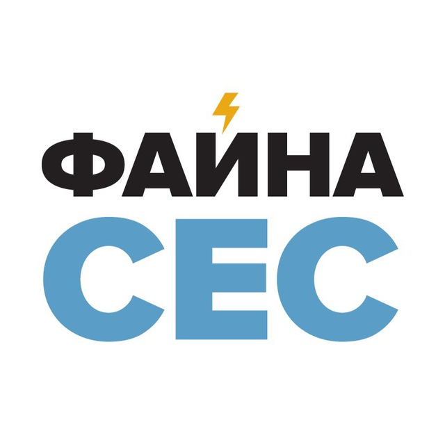

<div class="title">
  
</div>


```js
import { progress } from "./components/progress.js";
import { total } from "./components/total.js";

var allBuildings = [1,2,3,4,5,6,7,8,9,10,16,17,18,19,20,21,22,23,24,25];
var buildings = view(Inputs.select(allBuildings, {value: allBuildings, multiple: true, label: "Buildings"}));
var data = FileAttachment("data/data.json").json();
```

<div class="grid grid-cols-1">
  ${buildings.map(building => html.fragment`<div class="card">${resize(width => progress(data["schema"], {width, building}))}</div>`)}
</div>

---

## Goals: 22M UAH

<div class="grid grid-cols-1">
  <div class="card">
${
  resize((width) => total(data["totals"], {width}))
}
  </div>
</div>


---

## Links

Корисні посилання щодо проекту

<div class="grid grid-cols-2">
  <div class="card">
    <a href="https://t.me/c/2219771592/1">Telegram Chat</a>
  </div>
  <div class="card">
    <a href="https://docs.google.com/document/d/1bZEXS3u3kGHiLygIG0eEB0hI2osS925WtJZBeQJl2iI/edit">Проєкт безперебійного живлення критичної інфраструктури та систем безпеки ЖК «Файна таун»</a>
  </div>
</div>

<style>

.title {
  display: flex;
  flex-direction: column;
  align-items: center;
  font-family: var(--sans-serif);
  margin: 4rem 0 8rem;
  text-wrap: balance;
  text-align: center;
}

.title h1 {
  margin: 1rem 0;
  padding: 1rem 0;
  max-width: none;
  font-size: 14vw;
  font-weight: 900;
  line-height: 1;
  background: linear-gradient(30deg, var(--theme-foreground-focus), currentColor);
  -webkit-background-clip: text;
  -webkit-text-fill-color: transparent;
  background-clip: text;
}

.title h2 {
  margin: 0;
  max-width: 34em;
  font-size: 20px;
  font-style: initial;
  font-weight: 500;
  line-height: 1.5;
  color: var(--theme-foreground-muted);
}

@media (min-width: 640px) {
  .title h1 {
    font-size: 90px;
  }
}

</style>
